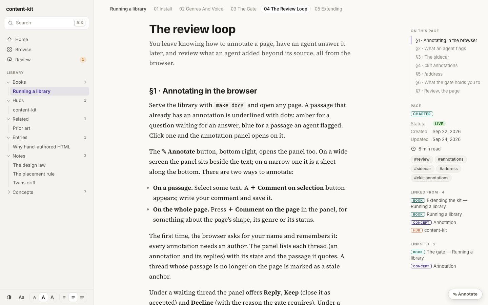
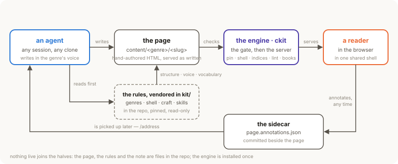
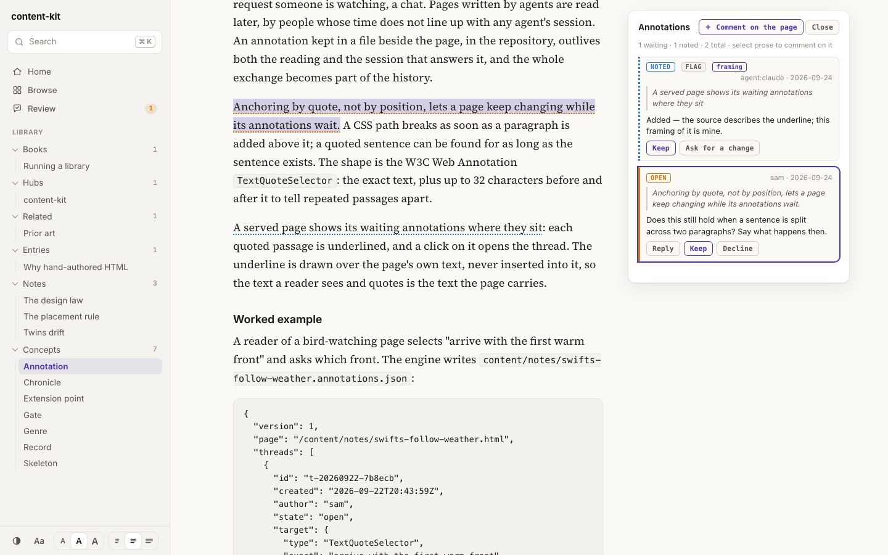
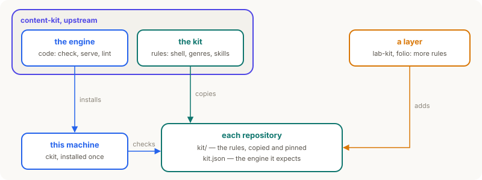

# content-kit

content-kit helps AI agents keep a library of documentation pages consistent. Each page is an HTML file in a Git repository. A command-line tool checks every page against written rules and serves the library in a browser, where a person can annotate any passage for an agent to answer later.

- **engine** — `ckit`, the command-line tool that creates, checks and serves pages. You install it once per machine.
- **kit** — the rules an agent follows: the kinds of page (genres), layout guides, agent skills, and the shell. `ckit init` copies it into each repository.
- **shell** — what every page shares: the stylesheet and script that give it its look, navigation and search, and the page templates.
- **layer** — a project that adds its own rules on top of the kit, such as [lab-kit](https://github.com/pierg/lab-kit) or [folio](https://github.com/pierg/folio).

**Documentation:** <https://pierg.github.io/content-kit/>, itself a content-kit library. Why each decision was made: [`VISION.md`](VISION.md). What changed in each release: [`CHANGELOG.md`](CHANGELOG.md).

<p align="center">

</p>

## How it works

<p align="center">
<picture>
  <source media="(prefers-color-scheme: dark)" srcset="assets/figures/how-it-works-dark.svg">
  
</picture>
</p>

A page's folder decides its genre: a note, a concept, a hub, a chapter in a book. The genre sets the page's structure, its voice and the checks it must pass. `ckit new` starts a page from its genre's template.

`ckit check`, the gate, runs every check in seconds, offline, the same way everywhere, CI included: links, tags, one paragraph per line, each genre's rules, the annotations. It reports every problem and changes nothing. `ckit lint` runs the same checks and regenerates the indices.

`ckit serve` shows the library in a browser. A reader selects a passage and writes an annotation, which is saved in a file beside the page. Later an agent runs the `/address` skill: it reads the annotation, edits the page and replies.

<p align="center">

</p>

## How a repository gets it and stays current

<p align="center">
<picture>
  <source media="(prefers-color-scheme: dark)" srcset="assets/figures/how-it-stays-current-dark.svg">
  
</picture>
</p>

The engine is code, so you install it once per machine. Every repository on the machine uses it.

The kit is rules, so `ckit init` copies it from the engine into each repository's `kit/` folder, where an agent finds every rule.

Two pins record what a repository was checked against: `kit/PIN` names the copy's source and holds its hash, and `kit.json` names the exact engine version. `make check` fails if the copy was edited or the engine is another version.

So an upgrade reaches each repository on purpose: after you install a new engine, `make check` fails in every repository until you run `make kit-sync` there, which copies the new kit and moves both pins. CI installs the version `kit.json` names.

A layer's installer runs `ckit init` too, and adds its rules in `kit/<layer>/`.

## Five minutes

```bash
uv tool install git+https://github.com/pierg/content-kit@v0.5.0     # the engine: ckit
ckit init my-library --name "My library"                            # copy the kit in and pin it
cd my-library
ckit new concept feedback-loop --title "Feedback loop"             # a page, from its genre's template
$EDITOR content/concepts/feedback-loop/index.html                  # write it
ckit lint && make check                                            # update the indices, run every check
make docs                                                          # read it at http://127.0.0.1:5180/
```

Python 3.10 or newer, and no dependencies; node, to check books. Without `uv`, clone this repository and run `bash install-engine.sh`, which puts its `bin/ckit` on your PATH. From then on `git pull` upgrades the engine.

## What a repository looks like

```
<repo>/
  kit.json          name · content folder · port · engine version · extension points
  Makefile          make check · docs · site · kit-verify · kit-sync
  kit/              copied by ckit init, pinned in kit/PIN, never edited here
    PIN             source <kit> <url> <commit> · hash <sha256 of the copy>
    shell/          lib.css · lib.js · search · review · record viewer · chronicle · annotations · page templates
    genres/         GENRES.md (how each genre reads) · genres.json (what is checked)
    craft/          how to lay out a comparison · diagram · table · timeline · code · figure
    skills/         /present (write a page) · /address (answer annotations) · /curate (organise)
    verify.sh       make kit-verify · make kit-sync
  .claude/skills/   links to kit/skills/ (and a layer's), where Claude Code looks for skills
  content/          notes/ concepts/ entries/ books/ hubs/ projects/ papers/ related/
                    catalog.json · search-index.json · backlinks.json · threads.json — generated, never edited
                    <page>.annotations.json — a page's annotations, written by the browser or ckit annotations
```

## The engine

| Command | Does |
|---|---|
| `ckit init [repo]` | copy the kit into a repository, add what it lacks, pin both |
| `ckit new <genre> <slug> [--topic --tags]` | start a page from its genre's template, on its topic; print how the genre reads |
| `ckit lint [paths]` | check links, prose, tags, genres and annotations; regenerate the indices |
| `ckit check` | every check, the engine version and whether the indices are current — every problem in one run (`make check` also verifies the kit's hash) |
| `ckit topics` · `tags` | list topics and tags; `add` · `rename` · `merge` · `assign` reorganise them |
| `ckit mv` · `rm --to` | move or retire a page: links rewritten, annotations and dates kept, the old address redirected |
| `ckit unwrap [paths] [--status]` | join hard-wrapped prose; `--status` also drops `Status: LIVE` labels — a page is live unless it says otherwise |
| `ckit serve` · `up` · `down` · `status` | show the library in a browser, on this machine only — anyone who can reach the server can write annotations (`--expose` to serve beyond it) |
| `ckit export [--base /repo/]` | the site as static files, for any static host |
| `ckit annotations …` | the annotations from the command line: list · show · add · reply · state · relabel · resolve · prune · check |
| `ckit genres` · `where` · `selftest` · `version` | the genres · where the kit comes from · the engine's own tests · the version |

## Develop

```bash
make check      # selftest · end-to-end · wheel install · this site's own checks · the README figures
```

A change to a check comes with a test page built to break it; without one, it is not a check. The README's figures are copies of the figures in the documentation pages (`python3 tools/readme_figures.py`). See [`CONTRIBUTING.md`](CONTRIBUTING.md).

MIT licensed.
